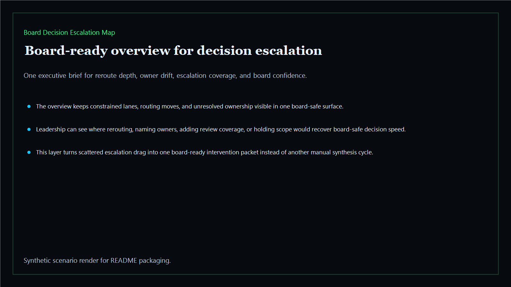
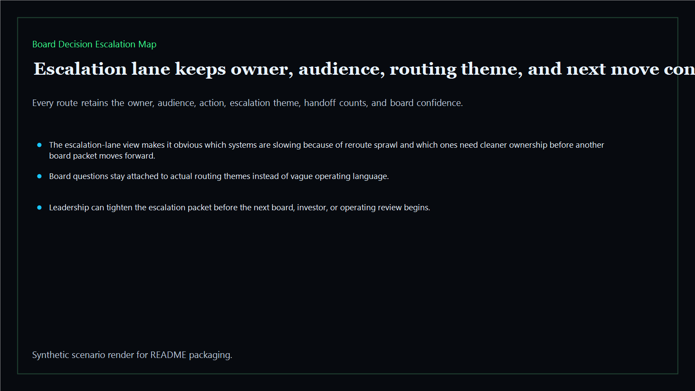
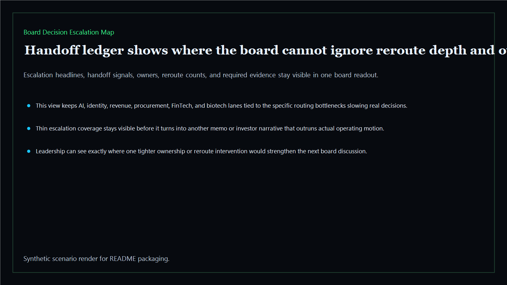
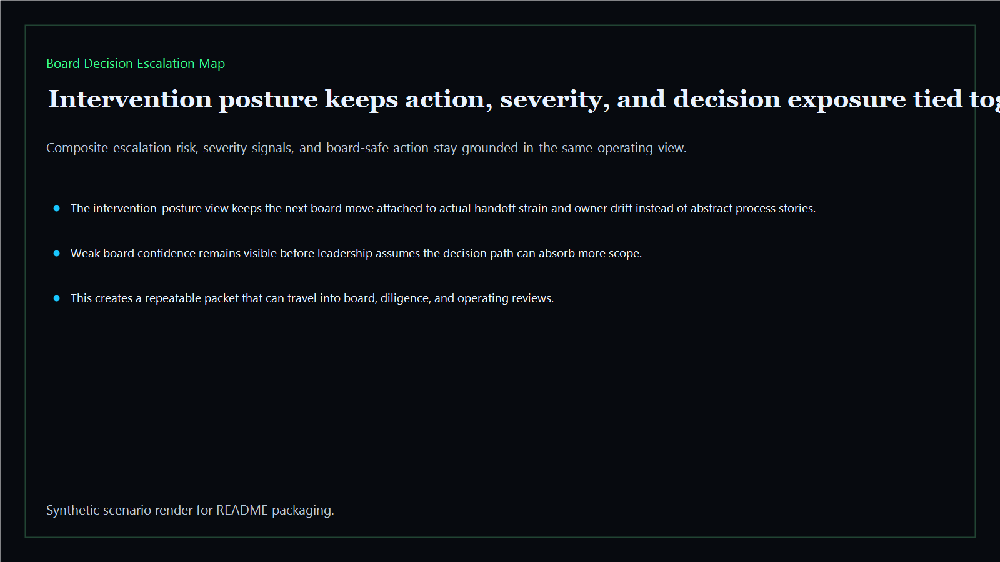

# Board Decision Escalation Map

Board-ready escalation-mapping surface for committee handoffs, owner drift, decision reroutes, and board-visible intervention paths across the executive estate.

- Live: `https://escalate-map.kineticgain.com/`
- Repo: `mizcausevic-dev/board-decision-escalation-map`

## Why this matters

Leaders need more than status labels. They need one surface that shows where committee handoffs, routing paths, and owner ambiguity are compounding board-visible drag.

## What it includes

- TypeScript executive-intelligence surface for escalation mapping with modeled routing lanes, owner drift, committee handoffs, and board-safe intervention posture
- synthetic executive lanes across AI, identity, revenue, FinTech, biotech, procurement, and public-sector readiness
- reusable outputs for escalation lanes, handoff ledgers, intervention packets, and board-ready operating memos
- prerendered static site, JSON payloads, screenshots, and docs

## Product depth

This is not a generic route table. It is a board-decision product for leadership teams that need to see which decisions are getting bounced across committees, where ownership has gone soft, and which escalation path should be simplified before the next investor or board review.

- **Buyer value:** gives CEOs, chiefs of staff, operating partners, and functional executives a direct view of where governance drag is delaying action or hiding accountability.
- **Technical proof:** turns synthetic escalation records into scored lanes, handoff ledgers, intervention posture, JSON payloads, static routes, and screenshot-ready proof.
- **GTM story:** positions Kinetic Gain as the executive layer that translates committee friction, owner drift, and decision reroutes into board-readable operating decisions.

## What these repos have in common

The Kinetic Gain executive-intelligence repos share the same pattern: one board-facing question, one modeled operating dataset, one scoring layer, one evidence packet, and one static/public surface that non-technical buyers can read without opening code.

- **Risk becomes legible:** escalation drag, committee loops, owner ambiguity, and confidence erosion become explicit operating signals.
- **Ownership stays attached:** every route keeps the accountable owner, audience, required evidence, and next move visible.
- **Proof is reusable:** generated HTML, JSON payloads, fixtures, tests, and screenshots all describe the same decision packet.

## Operating workflow

1. Model the escalation lanes and committee handoff signals in fixtures.
2. Score reroute depth, unresolved ownership, evidence coverage, decision clarity, value at stake, and board confidence.
3. Render the board packet as static HTML plus machine-readable JSON.
4. Verify tests, coverage, smoke routes, prerendered output, and README proof assets before publishing.
5. Use the public surface as a lightweight board-prep, due-diligence, or operating-model remediation artifact.

## Routes

- `/`
- `/escalation-lane`
- `/handoff-ledger`
- `/intervention-posture`
- `/verification`
- `/docs`

## Local run

```bash
cd board-decision-escalation-map
npm install
npm run verify
npm run prerender
npm run render:assets
```

## CLI

```bash
npx board-decision-escalation-map fixtures/board-decision-escalation-map.json --format summary
npx board-decision-escalation-map fixtures/board-decision-escalation-map-clean.json --format json
```

## Docs

- [Architecture](docs/architecture.md)
- [Origin](docs/ORIGIN.md)
- [Kinetic Gain Embedded](docs/KINETIC_GAIN_EMBEDDED.md)

## Screenshots





